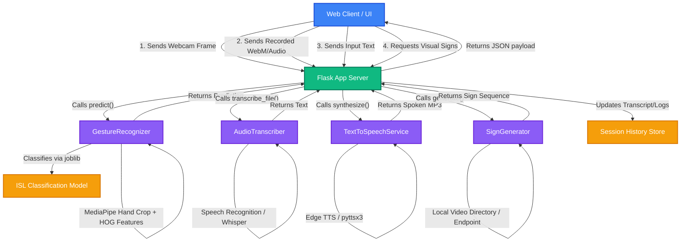
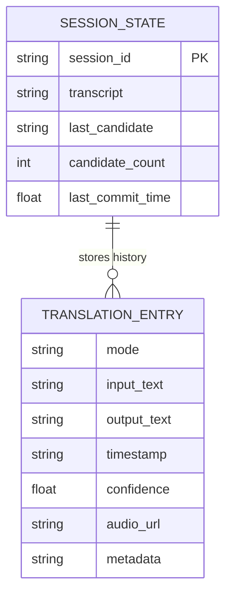

# AI for Real-Time Translation of Sign Language

Real-time Sign Language Translation System built with **Python**, **Flask**, **OpenCV**, **MediaPipe**, **scikit-learn**, and **Edge-TTS**.

---

## 🌟 Features

- 📹 **Live Webcam Sign Translation**: Translates webcam gestures to text in real-time, overlaying a MediaPipe hand skeleton tracking visualization.
- 🎙️ **Voice Speech-to-Text**: Converts microphone voice recordings or uploaded audio files into text using local transcription/Whisper.
- 🔊 **Text-to-Speech Output**: Translates text back into voice speech using high-quality online (`edge-tts`) or offline (`pyttsx3`) text-to-speech engines.
- 🎴 **Sign Storyboard & Lookups**: Converts typed text into a sequential visual storyboard of Indian Sign Language (ISL) or queries video resources.
- 💾 **Session History**: Persists the translation transcripts and generated audios to local session history files.

---

## 📐 System Architecture

This diagram details the interaction between the frontend client and backend Flask services:



---

## 📊 Data Model

The following ER Diagram shows the conceptual structure of the session storage, defining how translation histories and states are stored per session:



---

## 📂 Project Structure

```text
├── 📂 app/                           # Core Flask application folder
│   ├── 📄 config.py                  # Env configuration parser & defaults
│   ├── 📂 services/                  # AI/ML logic and translation processors
│   │   ├── 📄 gesture_recognizer.py  # MediaPipe extraction & HOG SVM classifier
│   │   ├── 📄 audio_transcriber.py   # Speech recognition/Whisper backend
│   │   ├── 📄 tts_service.py         # Text-to-Speech generator
│   │   ├── 📄 sign_generator.py      # Translates text to sign sequence storyboard
│   │   ├── 📄 session_store.py       # Manages session transcripts & logs
│   │   ├── 📄 text_tools.py          # Simplification and sanitization utils
│   │   └── 📄 sign_mapper.py         # Maps textual tokens to sign references
│   └── 📂 web/                       # UI presentation layer
│       ├── 📄 server.py              # Flask server, route configurations, API
│       ├── 📂 templates/             # HTML Templates
│       │   └── 📄 index.html         # Responsive, premium dark-themed interface
│       └── 📂 static/                # Client styles and scripts
│           ├── 📄 styles.css         # Modern styling rules
│           └── 📄 app.js             # Webcam streams, canvas overlays, and events
│
├── 📂 Indian/                        # Dataset containing folders A-Z and 1-9
├── 📂 runtime/                       # Model artifacts and session output directory
│   ├── 📄 hand_landmarker.task       # MediaPipe Hand Landmarker model
│   ├── 📄 isl_model.joblib           # Trained ISL classification model
│   └── 📄 isl_labels.json            # Class label mapping
├── 📄 main.py                        # App runner script
├── 📄 train_isl_model.py             # Script to train classifier on dataset
├── 📄 .env                           # Configuration settings
└── 📄 requirements.txt               # Declared package dependencies
```

---

## 🚀 Setup & Installation Guide

### 📋 Prerequisites
1. **Python 3.8 to 3.11** installed and configured in your environment variable PATH.
2. **FFmpeg** (Highly recommended): Required for browser-recorded audio transcription, converting WebM recordings to Wav on the fly.

### 💻 Step-by-Step Execution

#### Step 1: Open PowerShell / Terminal in the Project folder
```powershell
cd E:\UDIT\sign_language
```

#### Step 2: Configure Virtual Environment (Optional but Recommended)
```powershell
# Create the environment
python -m venv venv

# Activate on Windows
.\venv\Scripts\Activate.ps1
```

#### Step 3: Install Required Dependencies
```powershell
pip install -r requirements.txt
```

> [!WARNING]
> If you hit a `[WinError 32] The process cannot access the file because it is being used by another process` (commonly pointing to `cv2.pyd`) during installation:
> 1. Ensure you have no other Python terminals or Python code editors open.
> 2. Run: `deactivate` to exit the virtual environment.
> 3. Run the installation and application globally (see instructions below).

---

## 🏃 Run the Application

Once your packages are installed successfully, run:

```powershell
python main.py
```

Then open your browser and navigate to:
👉 **[http://127.0.0.1:5000](http://127.0.0.1:5000)**

---

## 🧠 Model Training

The application comes with a pre-trained ISL model (`runtime/isl_model.joblib`). If you modify or add images to the `Indian/` dataset and want to re-train the model, run:

```powershell
python train_isl_model.py --dataset Indian --output-model runtime/isl_model.joblib --output-labels runtime/isl_labels.json
```

### Optional Training Variants:
- Set batch size and epochs:
  ```powershell
  python train_isl_model.py --dataset Indian --epochs 5 --batch-size 256 --image-size 64
  ```
- Change train/test validation split size:
  ```powershell
  python train_isl_model.py --dataset Indian --test-size 0.2 --random-state 42
  ```

---

## ⚙️ Configuration Variables (`.env`)

Edit the [`.env`](file:///e:/UDIT/sign_language/.env) file to configure the parameters without restarting/modifying the codebase:

| Parameter | Default Value | Description |
| :--- | :--- | :--- |
| `APP_HOST` | `127.0.0.1` | Bind server IP address. |
| `APP_PORT` | `5000` | Port for Flask to listen on. |
| `APP_DEBUG` | `false` | Run Flask in reload/debug mode. |
| `MATCH_THRESHOLD` | `0.45` | Minimum classification confidence to commit gesture. |
| `STABLE_FRAMES` | `2` | Consecutive frames a gesture must stay active to commit. |
| `TTS_BACKEND` | `edge` | Text-To-Speech engine backend (`edge` or `local`). |
| `TTS_VOICE` | `en-IN-NeerjaNeural` | TTS Voice name selection. |
| `SIGN_CAPTURE_INTERVAL_MS`| `350` | webcam stream frame submission frequency in ms. |
| `WHISPER_MODEL` | `base` | Model category for transcription fallback. |

---

## 🔧 CLI Launcher Parameters

You can also override environment settings directly from the command line:

```powershell
python main.py --host 0.0.0.0 --port 5000 --debug
python main.py --isl-dataset Indian --match-threshold 0.50
python main.py --isl-model runtime/isl_model.joblib --isl-labels runtime/isl_labels.json
```

---

## 🩺 Diagnostics and Health Verification

### 1. Verification of Backend Compiler Output
```powershell
python -m py_compile app/config.py main.py app/web/server.py app/services/gesture_recognizer.py app/services/session_store.py app/services/sign_generator.py app/services/text_tools.py app/services/tts_service.py app/services/audio_transcriber.py train_isl_model.py
```

### 2. Verify API Health Endpoint
```powershell
@'
from app.config import load_config
from app.web.server import create_app

config = load_config()
app = create_app(config)
client = app.test_client()
resp = client.get('/api/health')
print(resp.status_code)
print(resp.json)
'@ | python -
```
